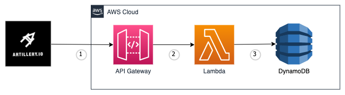

# aws-lambda-java-optimized-app

This project contains an AWS Lambda Maven application and scripts to pachage and deploy it in three different ways:
- As a Lambda function with Java 11 runtime.
- As a Lambda function with custom GraalVM Java 17 runtime packaged as the Lambda Layer.
- As a Lambda function with custom Java 19 (Amazon Corretto) runtime packaged as the Lambda layer.

All the options can be tested by the Artillery script to collect a performance benchmark.

## Architecture

The architecture is presented in the picture given below.



1. The https://www.artillery.io/ load script sends requests to API Gateway

2. API gateway invokes the Lambda function written in Java

3. The Lambda function writes a simple object that consists of Amazon Request ID to DynamoDB table using the DynamoDB-enhanced library from AWS Java 2 SDK


## Prerequisites
- Java 17
- Apache Maven
- [AWS SAM CLI](https://docs.aws.amazon.com/serverless-application-model/latest/developerguide/serverless-sam-cli-install.html)
- Docker
- [Artillery](https://www.artillery.io/)


## Project structure
- [lambda-app](lambda-app): The Maven application with the code of the Lambda function
- [bootstrap](bootstrap): The file required by a custom runtime that Lambda runs. Please read https://docs.aws.amazon.com/lambda/latest/dg/runtimes-custom.html to learn more.
- [build-java17-graalvm.sh](build-java17-graalvm.sh): The file to build ZIP files with Lambda code an layer for GraalVM Java 17 deployment option (custom runtime).
- [build-java19-custom.sh](build-java19-custom.sh): The file to build ZIP files with Lambda code an layer for Amazon Corretto Java 19 deployment option (custom runtime).
- [Dockerfile_graalvm](Dockerfile_graalvm): Docker file to build GraalVM Java 17 artifacts inside Docker container on Amazon Linux 2.
- [Dockerfile_corretto19](Dockerfile_corretto19): Docker file to build Amazon Corretto Java 19 artifacts inside Docker container on Amazon Linux 2.
- [loadtest.yaml](loadtest.yaml): Artillery load test.
- [template-java11-runtime.yaml](template-java11-runtime.yaml): AWS SAM template for deployment of the application with Java 11 Lambda runtime.
- [template-java17-graalvm-runtime.yaml](template-java17-graalvm-runtime.yaml): AWS SAM template for deployment of the application with Graal VM Java 17 custom Lambda runtime.
- [template-java19-custom-runtime.yaml](template-java19-custom-runtime.yaml): AWS SAM template for deployment of the application with Amazon Corretto Java 19 custom Lambda runtime. 

## Build

The application can be built by three different options listed below.
For custom runtimes, ensure that you have a Docker running.

### Java 11 runtime
```
cd lambda-app/ && mvn clean package -P java11
```

### GraalVM Java 17 custom runtime
```
sh ./build-java17-graalvm.sh
```

### Amazon Corretto Java 19 custom runtime
```
sh ./build-java19-custom.sh
```

## Deployment

Depending on the build option, you need a particular SAM template to deploy the artifacts crated by the build option chosen.

### Java 11 runtime
```
sam deploy -t template-java11-runtime.yaml --stack-name java11
```

### GraalVM Java 17 custom runtime
```
sam deploy -t template-java17-graalvm-runtime.yaml --stack-name java17-graalvm
```

### Amazon Corretto Java 19 custom runtime
```
sam deploy -t template-java19-custom-runtime.yaml --stack-name java19-custom
```

## Artillery load test

To test the deployed application by Artillery, you need to note the API gateway endpoint from AWS SAM Outputs and run the following command:
```
artillery run -t {PUT_YOUR_ENDPOINT_HERE} -v '{ "url": "/items/" }' loadtest.yaml
```

## Cold Start and Warm Start timings

Get the Lambda Cold Start and Warm Start timings by the following CloudWatch query:
```
filter @type = "REPORT"
    | parse @log /\d+:\/aws\/lambda\/(?<function>.*)/
    | stats
    count(*) as invocations,
    pct(@duration+coalesce(@initDuration,0), 0) as p0,
    pct(@duration+coalesce(@initDuration,0), 25) as p25,
    pct(@duration+coalesce(@initDuration,0), 50) as p50,
    pct(@duration+coalesce(@initDuration,0), 75) as p75,
    pct(@duration+coalesce(@initDuration,0), 90) as p90,
    pct(@duration+coalesce(@initDuration,0), 95) as p95,
    pct(@duration+coalesce(@initDuration,0), 99) as p99,
    pct(@duration+coalesce(@initDuration,0), 100) as p100
    group by function, ispresent(@initDuration) as coldstart
    | sort by coldstart, function
```


